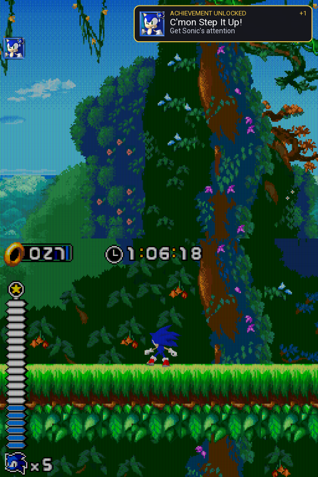
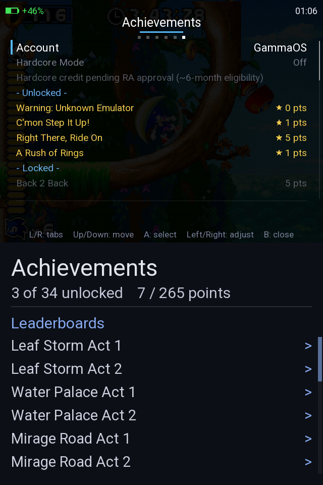
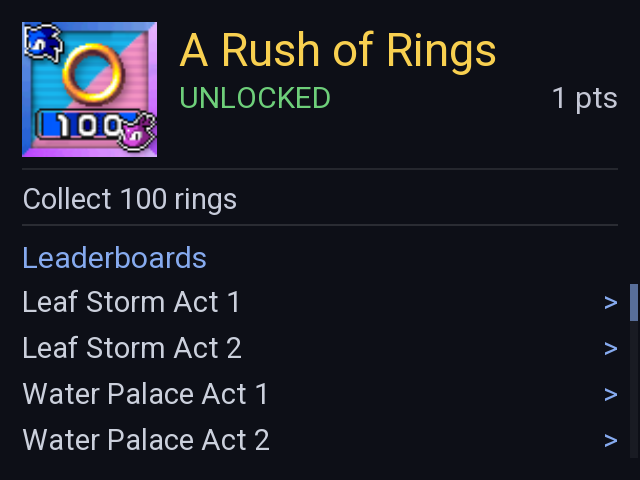
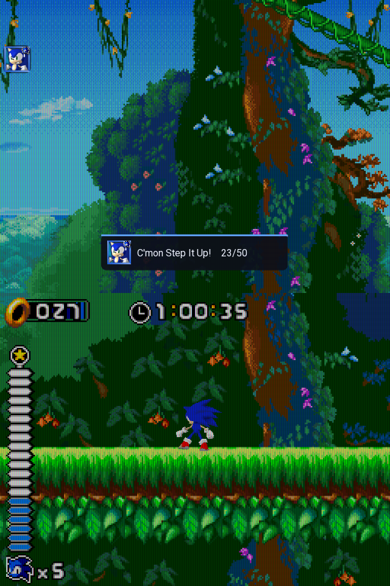

# RetroAchievements in GammaOS drastic-nano

## What this document is

This document describes the RetroAchievements integration in drastic-nano, a Nintendo DS player built into GammaOS. It is written for the RetroAchievements team so the integration can be reviewed and, where required, validated for hardcore support. The document explains what drastic-nano is, how the integration works end to end, and how it aligns with the RetroAchievements Hardcore Compliance Requirements.

## What GammaOS and drastic-nano are

GammaOS is a custom operating system and firmware for retro handheld game consoles, built on Android. It runs natively on retro handheld devices and is maintained by the GammaOS project.

drastic-nano is GammaOS's built-in Nintendo DS player. It is a small native app that loads the third-party closed-source DraStic DS emulator core in-process and drives it, rendering directly to the device's display through DRM and KMS (kernel mode setting). Because the DraStic core is loaded directly into the drastic-nano process, code in drastic-nano reads DraStic's emulated memory through direct in-process pointers, not through inter-process communication. The in-process approach eliminates IPC overhead and means memory reads are served with minimal latency, which matters because achievement evaluation reads memory continuously during play.

## Summary of the integration

drastic-nano integrates the official RetroAchievements client library (rcheevos) to provide full achievement, leaderboard, and rich presence support. The integration works end to end as follows:

When a game loads, drastic-nano logs in to the RetroAchievements server over HTTPS using stored credentials (a token, or a password if the token is stale), identifies the game by hashing the ROM, and loads its achievement and leaderboard data. Per-emulated-frame processing runs continuously during gameplay: because DraStic emulates on its own free-running thread with no per-frame callback, drastic-nano drives the library's frame-evaluation function (`rc_client_do_frame`) off the render loop's vblank tick (the display's vertical blanking interval, synchronized with its refresh), which is locked at approximately 60 Hz, matching the DS's frame rate. The library evaluates achievement triggers, measured progress, and rich presence against live DS main memory with each frame, and raises events when conditions are met.

Hardcore enforcement is in place: when hardcore mode is active, cheats, fast-forward, and save-state loading are disabled, and the launch auto-resume is blocked. Enabling hardcore restarts the game via a fresh process relaunch so a hardcore run starts clean, matching RetroAchievements convention. DraStic's in-process soft reset cannot be used because the emulator's boot-race longjmp guard prevents it from completing fully; the relaunch is the reliable reset mechanism. Disabling hardcore returns to softcore immediately without a restart.

The on-screen user interface surfaces the integration to the player through an Achievements overlay section in the in-game menu. Logged out, the overlay offers a chained on-screen keyboard for username and password. Logged in, it shows the player's account, a live Hardcore toggle, the achievement list with unlock badges and progress indicators, and (on dual-screen devices) a rich detail panel on the bottom screen showing the selected achievement or a game summary, plus tappable leaderboards with their online rankings. Every unlock, game completion, and server message is shown through a queued on-screen banner with the achievement badge image, title, description, and point value, plus a synthesized chime for unlocks. During gameplay, primed achievements appear as badge indicators at the screen edge, and measured-progress indicators show the current value as an on-screen popup. Badge images are cached on disk so they display instantly even over a slow network, and the achievement set is also cached per game so the list displays from the cache when the network is poor or offline.

The integration has been validated end to end on real hardware (an Anbernic RG DS) with real game tests (Sonic Rush). Rich presence reads live game state correctly, memory reads verify against the loaded ARM9 program and cartridge header, and achievement evaluation and unlock banners function as specified.

## The rcheevos library

The integration uses rcheevos, the official RetroAchievements client library.

**Source and version:** rcheevos is maintained by RetroAchievements at https://github.com/RetroAchievements/rcheevos. The integrated version is 12.3.0.

**License:** MIT. The license is retained with the vendored copy in `LICENSE.rcheevos`.

**Location:** The library is vendored at `frameworks/base/cmds/gammaos-nano/rcheevos/`.

**Build:** The library is compiled as the static library `librcheevos_nano` and linked into the drastic-nano binary. Lua support is disabled (`RC_DISABLE_LUA`) and ROM hashing is enabled (`RC_CLIENT_SUPPORTS_HASH`). The file set follows the upstream Package.swift, including all console definitions and hashing routines, and excluding only the libretro mapping, the external client loader, and the Windows RAIntegration toolkit, none of which apply to this platform.

**API:** The integration uses `rc_client`, the high-level client interface. This choice is intentional: rc_client owns the ecosystem-protecting parts of the protocol, including the achievement runtime, server communication, hardcore policy, session and ping cadence, rich presence evaluation, and unlock queueing with retry. drastic-nano provides only the three integration points the library asks for (memory read, server call, event handler) and the user interface. By using rc_client, the integration delegates protocol correctness and policy compliance to a single, auditable implementation maintained by the RetroAchievements team, rather than reimplementing those guarantees in drastic-nano itself.

## The three integration points

All three are implemented in `NanoRetroAchievements.cpp`.

### Reading memory

RetroAchievements flattens the Nintendo DS address space into the regions its console table defines. drastic-nano backs the two readable ones directly in-process (the DraStic core loads into drastic-nano's own process, so there is no inter-process communication): the 4 MB main System RAM, the work RAM of the DS's primary processor (the ARM9), at flattened address `0x000000..0x3FFFFF`; and the 16 KB ARM9 Data TCM at flattened address `0x1000000..0x1003FFF`. DraStic stores each as a contiguous little-endian block, so `readMemory` only has to select the region and copy:

```
if (address < main_ram_size) {              // 4 MB main RAM at 0x000000
    if (num_bytes > main_ram_size - address) return 0;
    memcpy(buffer, main_ram_base + address, num_bytes);
    return num_bytes;
}
if (address >= 0x1000000 && address < 0x1000000 + dtcm_size) {  // 16 KB Data TCM
    uint32_t off = address - 0x1000000;
    if (num_bytes > dtcm_size - off) return 0;
    memcpy(buffer, dtcm_base + off, num_bytes);
    return num_bytes;
}
return 0;                                    // unbacked address reads as zero
```

The read callback resolves the stable `main_ram_base` and `dtcm_base` pointers once at game load, both from DraStic's memory-region table (Data TCM sits next to Main RAM in that table). Any flattened address outside the two backed regions, including the `0x400000..0xFFFFFF` DSi-only padding between them, reads as zero. This is safe: at game load, `rc_client_validate_addresses` runs every achievement and leaderboard's memory references through this same read callback and marks any address it cannot read as unsupported, which prevents mis-evaluation and false-unlock from an unbacked region.

DS achievement logic lives overwhelmingly in main RAM, and RetroAchievements' own Nintendo DS developer guidance (its console-specific tips) points authors at main-RAM addresses (the console `0x02000000` region), which is exactly what drastic-nano serves. The 16 KB Data TCM, the other region the RetroAchievements DS memory map exposes, holds the ARM9 stack and fast data; drastic-nano serves it as well so a set that reads it is supported rather than disabled.

Before trusting the memory read, drastic-nano verifies it once the emulated cartridge finishes loading on a diagnostic thread. It confirms the base pointer is valid and page-aligned, then matches the main RAM contents against the loaded ROM (comparing the cartridge title and header that the DS boot sequence writes into RAM). The result is logged. If verification fails, the integration does not report unreliable reads to the runtime.

### Server communication

`rc_client` builds every request (login, identify, game load, unlock, ping, rich presence, and leaderboard fetch) and hands drastic-nano a URL and optional POST body through the `server_call` callback. A dedicated HTTP worker thread executes the request without blocking the render loop or the client thread.

The worker runs the device curl binary via fork/exec (not popen) so it can track the curl child PID and terminate it at shutdown. On flaky networks, a request can hold the full `--max-time` (10s for badge images, 30s for other requests), but if game-exit is requested while a curl is in-flight, `shutdown()` sends `SIGKILL` to the child before joining the worker thread. This means game-exit returns promptly instead of stalling on the curl timeout.

The worker reads the full response body and HTTP status code from curl's output and returns them to the client thread via `mDoneQueue`. A transport failure (no network, timeout, curl exit code) is reported as `RC_API_SERVER_RESPONSE_RETRYABLE_CLIENT_ERROR`, so the library automatically requeues the request. A successful curl (exit code 0 with any HTTP status, including 4xx/5xx) returns the status and body so `rc_client` can parse and handle server-side errors.

TLS is handled by the device curl binary using the system certificate store.

### Events

`rc_client` raises events through the event handler when significant state changes occur. `onEvent` produces UI events queued to the render thread and handles the following:

* `RC_CLIENT_EVENT_ACHIEVEMENT_TRIGGERED`: an achievement is unlocked. Emits an unlock UI event (which the render thread draws as an on-screen banner with the achievement badge, title, description, and point value), queues the badge for download, and plays the achievement chime.
* `RC_CLIENT_EVENT_ACHIEVEMENT_CHALLENGE_INDICATOR_SHOW` and `RC_CLIENT_EVENT_ACHIEVEMENT_CHALLENGE_INDICATOR_HIDE`: an achievement is primed (ready to trigger). A ChallengeShow UI event displays the achievement's badge at the screen edge during play; ChallengeHide removes it.
* `RC_CLIENT_EVENT_ACHIEVEMENT_PROGRESS_INDICATOR_SHOW` and `RC_CLIENT_EVENT_ACHIEVEMENT_PROGRESS_INDICATOR_UPDATE`: an achievement has measured progress. A ProgressShow UI event displays a brief on-screen popup with the achievement badge and the current measured value (e.g. "23/50"). Repeated updates re-enqueue the event with the new value.
* `RC_CLIENT_EVENT_ACHIEVEMENT_PROGRESS_INDICATOR_HIDE`: the progress indicator stops applying. A ProgressHide UI event removes the on-screen popup.
* `RC_CLIENT_EVENT_GAME_COMPLETED`: every achievement in the set is unlocked (mastery). A Mastery UI event signals completion.
* `RC_CLIENT_EVENT_LEADERBOARD_STARTED`, `RC_CLIENT_EVENT_LEADERBOARD_SUBMITTED`, and `RC_CLIENT_EVENT_LEADERBOARD_FAILED`: leaderboard submission state changes. The corresponding UI events queue the leaderboard title so the render thread can draw them.
* `RC_CLIENT_EVENT_RESET`: the runtime requests the achievement engine be reset (e.g. hardcore is toggled). The client thread calls `rc_client_reset` to reset the runtime (not the emulator; disabling hardcore does not require an emulator reset).
* `RC_CLIENT_EVENT_SERVER_ERROR`: a server returned an error message. A ServerError UI event surfaces the message to the player.
* `RC_CLIENT_EVENT_DISCONNECTED` and `RC_CLIENT_EVENT_RECONNECTED`: the server connection is lost or restored. These are logged only; unlocks are queued and retried automatically by `rc_client`.

All events are produced on the client thread and queued as UI events, so rendering stays on the render thread.

## Threading model

All `rc_client` calls originate from a single dedicated client thread, so the library never requires thread-safety. That thread:

* Creates the `rc_client` instance and sets up the three integration callbacks (read memory, server call, event handler).
* Logs in using stored credentials (token preferred, falling back to password on repeated token failures).
* Identifies and loads the game by hash.
* Drives `rc_client_do_frame` once per render-loop vblank tick (approximately 60 Hz), matching the DS frame rate.
* Calls `rc_client_idle` at least once per second when the game is not actively running (overlay open, screen off, or between frames).
* Drains completed HTTP responses from `mDoneQueue` and re-enters `rc_client` with the callback to allow the library to process the response.
* Periodically refreshes the achievement-list snapshot for the overlay (on game load and after each unlock).
* Refreshes the leaderboard tracker values every 1.5 seconds so the bottom-screen panel shows live progress.
* Warms the on-disk badge cache every 60 seconds.
* Recomputes rich presence every 400 ms.
* Applies hardcore toggled from the in-game UI and signals the render loop to relaunch when enabling hardcore.

A separate HTTP worker thread performs the HTTPS requests (device curl) and decodes downloaded badge PNG images off the render and client threads; the decoded RGBA pixels are handed to the render thread via `mBadgeQueue`.

A short-lived diagnostic thread verifies the in-process Main RAM read once the cartridge finishes loading. It is purely diagnostic and does not affect the runtime.

The render thread only enqueues requests (pause state changes, login requests, hardcore toggles, leaderboard entry fetches) and drains UI events to feed to the overlay for drawing. It never calls `rc_client` directly.

## Game identification

When the ROM has loaded, drastic-nano calls `rc_client_begin_identify_and_load_game` with `RC_CONSOLE_NINTENDO_DS`, the ROM file path, and null hash data (instructing `rc_client` to compute the hash). The `rc_client` library computes the canonical Nintendo DS hash from the file and resolves it against the RetroAchievements server. drastic-nano does not implement its own hashing, so the hash always matches what the server expects, and games are identified correctly even if their filenames are non-standard.

## Frame processing

DraStic emulates on its own free-running thread, and the render path deliberately runs decoupled from it to maintain a steady 60 fps display. There is no per-emulated-frame callback to hook, and the emulator's frame counters are not usable for timing on this architecture.

Instead, drastic-nano drives `rc_client_do_frame` off the render-loop vblank tick, which is locked at approximately 60 Hz, matching the DS frame rate. The client thread advances the tick counter exactly once per vblank and calls do_frame exactly once per advance, never in a batch. This is critical: the read callback returns a snapshot of live DS RAM, which only holds the producer's most recent emulated frame. Calling do_frame multiple times per advance would feed `rc_client` the same memory snapshot repeatedly, collapsing its Delta (previous frame state) to equal its Current value. This destroys single-frame edge triggers: achievement conditions that are true for exactly one emulated frame then false the next (such as level-complete flags). One call per vblank preserves those edges by keeping the previous poll's value as the Delta, so a clean true-then-false transition is captured.

Opening the in-game overlay pauses the emulator: DS Main RAM stops advancing while the menu is up, even though the render loop keeps ticking to draw the menu. While the game is paused, the client thread stops calling `rc_client_do_frame` and calls `rc_client_idle` at least once per second instead, as the integration guide requires, to keep the player in the active players list and the session alive without evaluating a frozen memory image. The same applies when the emulator truly stops (sleep mode, screen off). Frame evaluation resumes when the menu closes and the emulator runs again.

## Hardcore support

drastic-nano enforces the hardcore restrictions described in the RetroAchievements integration guide. While hardcore is enabled and the loaded game has achievements, the following are disabled:

* Loading save states, including the launch auto-resume. Saving save states remains allowed, but saved states cannot be loaded in hardcore.
* Gameplay-altering cheats (DraStic Action Replay codes and the cheat menu).
* Fast forward. RetroAchievements permits fast forward in hardcore, but drastic-nano disables it as a stricter, conservative choice.

drastic-nano has no rewind, slowdown, or frame-advance feature, so there are no other restrictions to enforce.

Save-state loading at launch (auto-resume) is disabled in hardcore so a session never silently resumes from a loaded state.

Login, game identification, and achievement-set loading happen asynchronously after the emulator is already running. Once signed in with the hardcore preference on, the same restrictions (save-state loading, cheats, fast forward) are enforced throughout the remaining load window, before the achievement set is confirmed, so the player cannot advance the game into an illegitimate state ahead of evaluation. The restrictions lift only if the load resolves to a game with no RetroAchievements support. An offline session that never signs in is not restricted, since no hardcore credit is possible without a server session.

Enabling hardcore from the in-game Achievements menu restarts the game with a fresh process relaunch to boot the ROM clean from the title screen, matching the RetroAchievements convention that a hardcore run starts with no pre-hardcore progress. The restart is a full relaunch because DraStic's in-process soft reset is unusable: a boot-race longjmp guard in the emulator neuters it, causing it to half-complete and freeze the game. The fresh relaunch path reads the persisted `persist.gammaos.drastic_nano.ra_hardcore` property and comes up already in hardcore. Disabling hardcore drops to softcore live, with no restart. When the runtime requests a reset on a hardcore change, drastic-nano resets the rc_client achievement runtime (not the emulator). When a game has no achievements, leaderboards, or rich presence (when `rc_client_is_processing_required` returns false), drastic-nano disables hardcore while that game is loaded. Pause spam is limited using `rc_client_can_pause`: opening the in-game menu pauses the emulator, so in an active hardcore session the integration consults `rc_client_can_pause` before opening the menu and declines to open (the player keeps playing) when they have paused too recently. It is consulted only on a pause request, never every frame, so its internal frame counter stays meaningful. While paused, the screen is obscured by the in-game menu overlay.

During bring-up, hardcore defaults to off (`persist.gammaos.drastic_nano.ra_hardcore=0`) so an unvalidated build cannot risk a player account. The product default is hardcore-on upon validation by the RetroAchievements team.


## User agent and hardcore validation

Every request to the RetroAchievements server includes a User-Agent header in the format the server expects:

```
GammaOS-DrasticNano/1.0.0 (Android <os_version>) rcheevos/12.3.0
```

The product token `GammaOS-DrasticNano` contains no spaces and the version `1.0.0` is numeric so the server can perform version negotiation. The Android release version is read from `ro.build.version.release`, and the rcheevos clause comes from `rc_client_get_user_agent_clause`. This client has never identified itself to RetroAchievements as any other product.

Hardcore credit from the RetroAchievements server requires the `GammaOS-DrasticNano` User-Agent to be on the server's recognized-emulator list. While unvalidated, the loaded achievement set includes a zero-point "Warning: Unknown Emulator" entry and the server treats hardcore unlocks as softcore, but softcore functionality is unaffected. Hardcore eligibility also depends on the eligibility-timeline requirement (at least six months from the client's first public release), which the in-game Achievements view surfaces as a compliance note. The client identifier is unique and numeric, enabling the RetroAchievements team to recognize it once added to the approved list.

## Hardcore compliance self-assessment

This maps the integration to the RetroAchievements Hardcore Compliance Requirements (sections A to H of that specification), as a self-assessment to aid review.

### A. RetroAchievements features

* UI visibility: the Achievements overlay section lists every achievement, reached in two inputs (open the overlay, switch to the Achievements tab).
* Triggers, Measured, Trigger: rc_client evaluates triggers off the per-vblank `rc_client_do_frame` call (see Frame processing section of the full documentation). Measured progress is shown on each measured locked achievement in the list and as an on-screen popup during play; primed achievements (the Trigger/challenge state) are shown as badge indicators at the screen edge during play.
* Rich Presence and Leaderboards: both function. rc_client computes and submits rich presence on its ping cadence; leaderboards list with live trackers and open their online rankings.
* Offline queueing: owned by rc_client. A transport failure is reported as retryable so the unlock is re-queued, not lost.
* Save state hit storage: not implemented. `rc_client_serialize_progress` and `rc_client_deserialize_progress` are the integration points; this feature is out of scope.
* Toolkit (RAIntegration) support: not applicable (no Windows build).
* Save file compatibility: DraStic's standard save format is used unchanged.

### B. Hardcore rules enforcement

* Cheats are disabled in hardcore (the cheats menu is closed off).
* No rewind, slowdown, or frame advance exists to gate.
* Loading save states (and the launch auto-resume) is always blocked in hardcore; saving is still allowed, but those states are not loadable while hardcore is on.
* Rich Presence and Leaderboards cannot be disabled (no such control exists).
* The launch auto-resume is disabled in hardcore, so a hardcore session never resumes from a loaded save state.
* Mode switching: enabling hardcore (softcore to hardcore) performs a full game reset via a fresh relaunch; disabling (hardcore to softcore) is live, no reset.
* No memory editor, debugger, TAS, or input-playback feature exists.

### C. Identity

* User agent: `GammaOS-DrasticNano/1.0.0 (Android <version>) rcheevos/12.3.0`, a unique product token with no spaces and a numeric version. This client has never identified itself to RetroAchievements as any other product.

### D. Eligibility timeline

* The "at least six months from first public release" window is a product-level matter; the compliance note in the Achievements menu reflects the current timeline status.

### E. Defaults and UX

* Default mode is softcore during bring-up (so an unvalidated build cannot risk a player account). Enabling hardcore is a labelled toggle in the Achievements menu.
* The game-start message states the active mode ("Hardcore mode." or "Softcore mode."). Because enabling hardcore restarts the game, that message re-announces the mode for the fresh hardcore session.

### F. Transparency and legality

* This component ships `LICENSE` (Apache-2.0), `LICENSE.rcheevos` (MIT), and `NOTICE`. A product-wide FOSS-components/licenses page, a privacy policy (data retention, server location, GDPR), and a monetization disclosure are GammaOS-product-level items, outside this integration.

### G. Auto-fail criteria

* None apply: save-state loading is blocked in hardcore; there is no rewind, slow-motion, or frame advance; cheats are blocked in hardcore; switching to hardcore performs a full reset; the user agent is unique and has never identified as another client.

### Memory coverage

* The integration serves both readable regions the RetroAchievements DS console table defines: the 4 MB main System RAM, where DS achievement logic overwhelmingly lives and which the validated Sonic Rush set exercises, and the 16 KB ARM9 Data TCM. Any flattened address outside those two regions (the DSi-only padding) reads as zero and is marked unsupported by rc_client through the read callback at load time, so such references are disabled rather than mis-evaluated and cannot false-unlock.

## Login and credentials

Players log in with a RetroAchievements username and password through a chained on-screen keyboard in the Achievements overlay section. The username entry completes first, then the password. On login success, drastic-nano discards the password and stores only the returned access token in a local file under the GammaOS system data directory (`/data/system/nano_ra/token`) with owner-only permissions (mode 0600), never writing credentials to a system property or any world-readable location. On subsequent boots the client attempts login with the stored token; if token authentication fails after several attempts, the client falls back to stored password authentication, which also re-establishes a fresh token. This fallback prevents stale tokens from locking the user out. The token file, once captured, supersedes any bootstrap password file. The username and password are sent to the server only on the initial login; all later sessions reuse the token.

## Rich presence, sessions, and unlock delivery

rc_client owns the rich presence computation, the session lifecycle, the ping cadence, and the unlock queue. The client computes the rich presence string from the game's rich-presence script by reading emulated memory through the integration's memory callback, and submits it to the server on its periodic ping. drastic-nano drives this cycle through `rc_client_do_frame` once per render vblank while a game is active, and through `rc_client_idle` at least once per second when the emulator is paused or the screen is off. This keeps the player's profile and "now playing" status current. drastic-nano also reads the current rich presence string (`rc_client_get_rich_presence_message`) and logs it for diagnostics during bring-up. The runtime queues any unlock that cannot be delivered immediately and retries automatically. There is no control to disable rich presence, so it remains active in both hardcore and softcore modes. Server disconnect and reconnect events are logged; pending/delivered status per unlock is not surfaced to the player.

## Save states

Hardcore mode disables loading save states, so save-state interaction with achievement progress occurs only in softcore. The integration does not capture or restore the rc_client achievement-runtime state alongside drastic-nano's own save states. The rcheevos library exposes `rc_client_serialize_progress` and `rc_client_deserialize_progress` for this purpose; wiring those APIs to drastic-nano's save-state mechanism is out of scope for this implementation.

## User interface

All RetroAchievements messages are conveyed through a single rich on-screen banner positioned at the top right: achievement badge image (when present), header (e.g. "ACHIEVEMENT UNLOCKED"), title, description, and point value, with a synthesized achievement chime. The banner is colored by message kind (gold for unlocks, green for login success, red for errors, blue for informational placards). Text that overflows the banner width scrolls horizontally with a character marquee. Banners are queued so several achievements unlocking at once show one after another instead of clobbering each other; while unlocks are queued each banner displays for a minimum 3 seconds before advancing to the next, otherwise for its full 6-second duration. If a badge image has not arrived when a banner is about to expire (slow network), the banner extends to allow the image to appear.



The Achievements overlay section shows a "Log In to RetroAchievements" entry when logged out, which opens the chained username and password keyboards. When logged in, it displays the account username, a live Hardcore toggle, a compliance note about the six-month eligibility timeline for hardcore credit, and the achievement list built from rc_client. Unlocked achievements appear at the top in gold each with a star; locked ones appear below grouped by progress bucket (bucket labels such as "Active" come from rc_client) and are dimmed, with blue section headers. Each achievement row shows the title, point value, and for measured achievements a progress indicator (e.g. "23/50"). Selecting an achievement displays its full description in a detail band. Badge images are downloaded from the RetroAchievements media host and cached to disk; the achievement set is also cached per game so the list remains usable (showing last-synced state) when the network is slow or unavailable.



On dual-screen devices the bottom DS screen serves as a rich RetroAchievements detail panel while the Achievements section is open, rendered on the secondary framebuffer alongside the on-screen keyboard. The detail panel mirrors the top screen's selected row: for an achievement, it shows the badge, a marquee title, unlocked/locked status, point value, and the full description; for a non-achievement row (headers or the account row) it shows a game summary instead. Below the achievement details is the game's complete leaderboard list, populated from rc_client with live tracker values (e.g. current score). Each leaderboard has a touch chevron. The panel is touch-driven: dragging scrolls with momentum, a side scroll bar indicates position, and tapping a leaderboard opens its online rankings fetched from the server showing rank, player name, and formatted score, with a back button to return to the leaderboard list. Text rendering snaps to whole pixels and samples with nearest filtering so overlay text remains crisp on low-resolution DS screens. While the overlay is open on any section other than Achievements, the bottom screen is dimmed with a scrim.



During play, on top of the running game, drastic-nano draws two in-gameplay indicators raised by the runtime. The challenge indicator appears when an achievement is primed (the Trigger state in rc_client terminology): the achievement's badge is drawn at the screen edge and removed when the indicator clears. The progress indicator appears as a brief on-screen popup when measured progress changes: it shows the achievement badge and the current measured value (e.g. "23/50") and auto-hides after a short interval. The achievement list additionally displays the measured value on each measured locked achievement so the Measured flag is visible both in the list and during gameplay.



## Configuration

The integration is controlled by device properties:

* `persist.gammaos.drastic_nano.ra_enabled` enables or disables RetroAchievements. When set to 0, the integration does not start.
* `persist.gammaos.drastic_nano.ra_hardcore` selects the hardcore or softcore mode. When set to 1, hardcore is active; when 0, softcore is active. This setting is persisted across game sessions. Enabling hardcore restarts the game fresh (via process relaunch) so the session starts clean. Disabling hardcore applies the change live without a restart.

Four debug properties exist for bring-up and are not intended for shipping builds:

* `sys.gammaos.drastic_nano.ra_debug` edge-logs the achievement trigger bytes when they change, confirming which condition is met.
* `sys.gammaos.drastic_nano.ra_test_unlock` fires a local test unlock banner (badge, title, description, point value, and chime) for the first real achievement of the loaded set (skipping server pseudo entries), with no server award. This allows the unlock presentation to be validated without reaching a real condition.
* `sys.gammaos.drastic_nano.ra_test_hardcore` toggles hardcore live (set to 1 or 0) exactly as the Achievements menu does, enabling the hardcore restart to be tested without navigating the on-screen UI.
* `sys.gammaos.drastic_nano.ra_test_indicator` raises or clears a synthetic challenge and measured-progress indicator for the first real achievement (set to 1 or 0), so in-gameplay indicators can be checked without reaching a real primed or progress condition.

## Files

The RetroAchievements integration in drastic-nano comprises:

* `NanoRetroAchievements.h` and `NanoRetroAchievements.cpp`: the core integration, including the three rc_client callbacks (memory read, server communication, event handling), the dedicated client thread that owns rc_client, the HTTP worker thread for HTTPS requests, UI event queueing, hardcore state management, and badge caching.
* `frameworks/base/cmds/gammaos-nano/rcheevos/`: the vendored rcheevos library (version 12.3.0), built as the static library `librcheevos_nano` with Lua disabled and hashing enabled.
* `frameworks/base/cmds/gammaos-nano/DrasticRunner.{h,cpp}`: the in-process DraStic core driver that exposes the DS Main RAM pointer (via `dsMainRam()`) which the read callback uses to serve achievement logic memory to rc_client.
* `main.cpp`: initializes the integration once the first DS frame is ready, calls `onRenderFrame()` each render iteration to drive `rc_client_do_frame`, gates fast-forward and save-state loading in hardcore, polls `takeHardcoreRestart()` to relaunch the game when hardcore is enabled, and shuts the client down at exit.
* `OverlayMenu.{h,cpp}`: the Achievements overlay section, the chained on-screen-keyboard login, the rich queued unlock and message banner, the bottom-screen detail panel with achievement details and leaderboard rankings (touch-driven with momentum scrolling and online rankings drill-in), and the live Hardcore toggle.
* `OverlayGfx.{h,cpp}`: pixel-snapped text rendering for crisp display on low-resolution panels, badge image upload to GPU textures, and geometry-drawn unlock indicator graphics.
* `LICENSE`, `LICENSE.rcheevos`, `NOTICE`: the license files for this component (see Licensing below).

## Licensing

The drastic-nano frontend code (the RetroAchievements integration, overlay UI, and graphics) is licensed under the Apache License 2.0 (see `LICENSE` and `NOTICE`). The integration links rcheevos (the `rc_client` library) from RetroAchievements.org under the MIT License (see `LICENSE.rcheevos`, also reproduced in `NOTICE`). The `Android.bp` build file declares both license kinds and references these three files via the `drastic_nano_license` license module. DraStic itself is separate, closed-source software and is not included in this component's licensing scope.

## Contact

For questions about the RetroAchievements integration in drastic-nano, contact the GammaOS team.