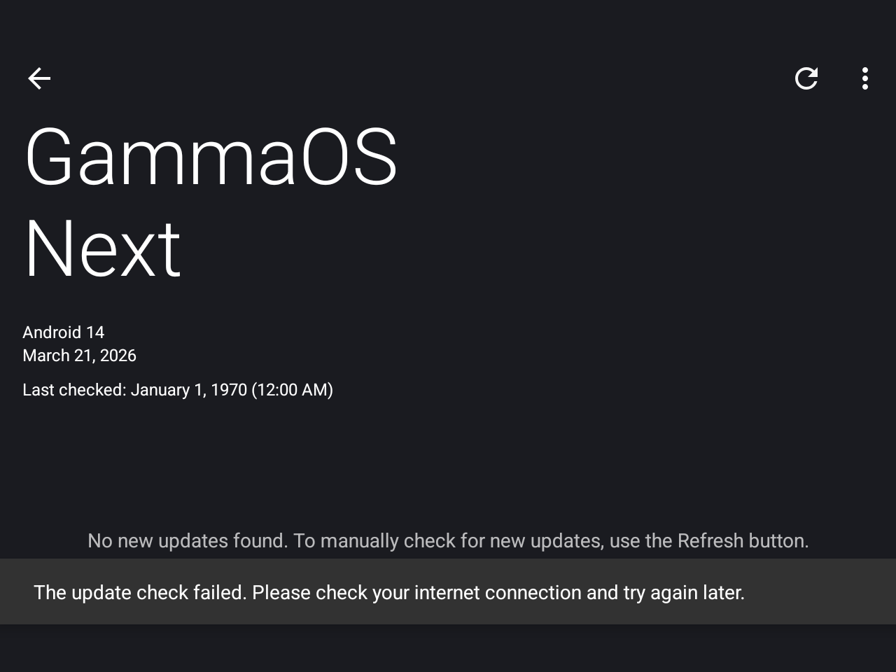
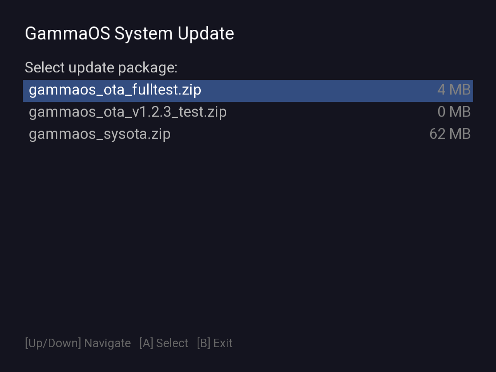
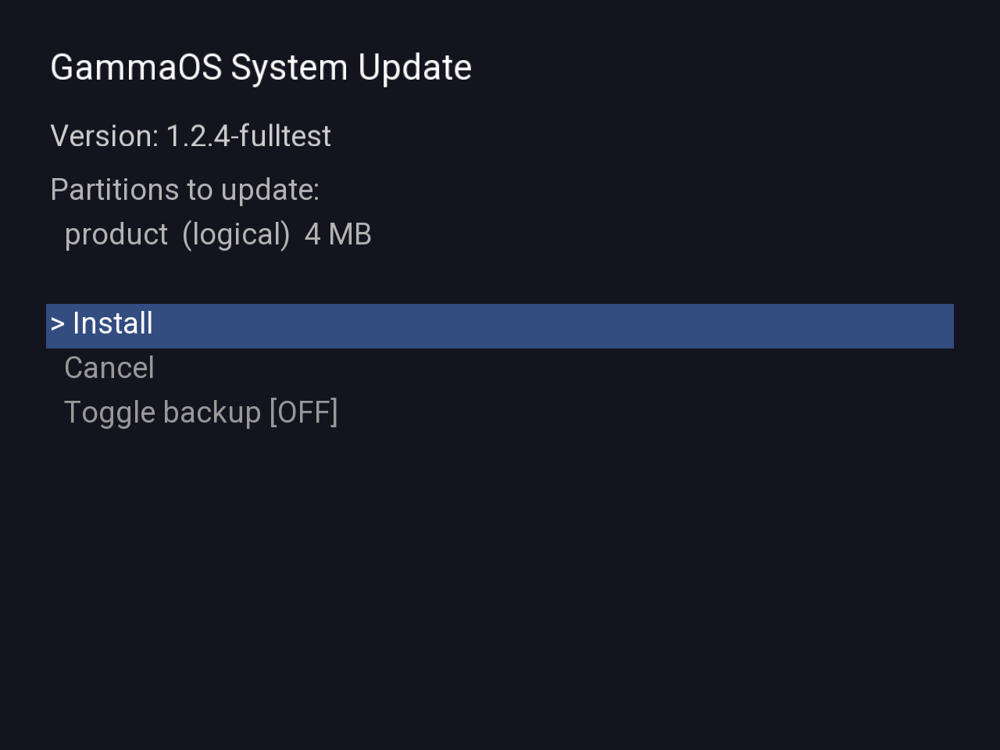

# GammaOS OTA Update System

## Overview

GammaOS OTA is a custom in-place system update mechanism for GammaOS Next (Android 14, TrebleDroid GSI). Unlike standard Android A/B OTA which requires dual partition copies, GammaOS OTA writes directly to live partitions, including the mounted root filesystem, without requiring an unmount, a recovery partition, or fastboot access.

This is necessary because TrebleDroid GSI super partitions typically lack space for dual system copies, making standard A/B OTA impossible.

> **For OEM integrators**: this document is both the design reference and the integration guide. If you are wiring OTA up for a new device or standing up your own update server, start with [OTA Server and OEM Integration](#ota-server-and-oem-integration) (the three variants, the check URL, the server JSON contract, and self-hosting) and [Build Integration](#build-integration) (where the variant properties come from). In practice the only per-device property you must author is `ro.gammaos.device`; the variant and version properties are set for you by the build.

## Screenshots

### Updater App (GammaOS Next branding)


### OTA File Browser


### Confirm Screen (partition list, backup toggle)


> **Note**: SurfaceFlinger is kept alive during the flash process so progress is visible on screen. However, `screencap` may fail during writing because the framework (zygote) is stopped.

## Architecture

```
┌─────────────────────────────────────────────────────────────┐
│                    GammaOS OTA System                       │
├─────────────────────────────────────────────────────────────┤
│                                                             │
│  ┌──────────────┐    ┌──────────────────────────────────┐   │
│  │  Updater App │    │    gammaos-ota (native binary)   │   │
│  │  (Java/Kotlin)│───▶│  EGL/GLES2 UI + FreeType text   │   │
│  │              │    │  Direct block device writes      │   │
│  │  Modes:      │    │  XZ decompression                │   │
│  │  - Online    │    │  SHA-256 verification             │   │
│  │  - Local     │    │  Partition resize (grow/shrink)   │   │
│  └──────────────┘    │  Backup & restore                │   │
│                      └──────────────────────────────────┘   │
│                                                             │
│  ┌──────────────┐    ┌──────────────────────────────────┐   │
│  │  OTA Server  │    │    SELinux Policy (gammaosota)    │   │
│  │  ota.gammaos │    │  Block device RW, tmpfs exec,    │   │
│  │  .sh/api/v1/ │    │  HAL access, property control    │   │
│  └──────────────┘    └──────────────────────────────────┘   │
│                                                             │
└─────────────────────────────────────────────────────────────┘
```

## Components

### 1. Updater App (`packages/apps/Updater/`)

The LineageOS Updater app, rebranded to "GammaOS Update", serves as the entry point:

- **Online mode**: Checks `https://ota.gammaos.sh/api/v1/{ro.gammaos.device}/{ro.gammaos.variant}` for updates (see [OTA Server and OEM Integration](#ota-server-and-oem-integration) for the three variants and how the URL is built), downloads the OTA zip, user taps INSTALL → OK to begin
- **Local update** (menu): Opens Android's `ACTION_OPEN_DOCUMENT` file picker. Imports the selected zip as an update in the list. GammaOS OTA packages (detected by `manifest.json` in zip) skip `RecoverySystem.verifyPackage()`.
- **Install from storage** (menu): Opens Android file picker, copies the selected zip to `/data/gammaos_ota/`, extracts it, validates `manifest.json`, and launches `gammaos-ota` with `autoinstall=1` for immediate installation.

The app runs as `android.uid.system` (via `sharedUserId` in manifest), giving it `system_app` SELinux privileges. This allows it to:
- Set system properties (`sys.gammaos.ota.package`, `sys.gammaos.ota.autoinstall`)
- Start/stop the `gammaos-ota` service via `ctl.start`

When the user initiates an install via the online flow, a persistent "GammaOS System Update" `ProgressDialog` reading "Preparing update..." is shown. This dialog stays visible until `gammaos-ota`'s fullscreen EGL UI takes over, providing a seamless transition with no gap. `GammaOtaInstaller.java` extracts the OTA zip to `/data/gammaos_ota/`, verifies the manifest, and launches the native OTA binary.

### 2. Native OTA Binary (`frameworks/base/cmds/gammaos-ota/`)

The core of the system. A native C++ binary that:

1. **Stages itself to tmpfs** before any writes begin
2. **Renders a full-screen UI** via EGL/GLES2 on a SurfaceFlinger surface
3. **Handles input** from gamepad (d-pad, A/B buttons), keyboard, and touch
4. **Flashes partitions** by writing directly to block devices
5. **Verifies writes** via SHA-256 read-back

#### Source Files

| File | Purpose |
|------|---------|
| `main.cpp` | Entry point, tmpfs staging, SurfaceFlinger wait |
| `OtaMenu.cpp` | EGL/GLES2 UI, input handling, state machine |
| `OtaMenu.h` | UI class definition, menu states |
| `OtaFlasher.cpp` | Flash logic, resize, backup, restore, verification |
| `OtaFlasher.h` | Flasher class definition, FlashPhase enum |
| `OtaManifest.cpp` | JSON manifest parser |
| `OtaManifest.h` | Manifest data structures |
| `XzDecompressor.cpp` | XZ decompression to file, block device write, SHA-256 |
| `XzDecompressor.h` | Decompressor class definition |
| `OtaDisplay.cpp` | Direct fbdev/DRM rendering fallback (if SF unavailable) |
| `OtaDisplay.h` | Display class definition |
| `gammaos-ota.rc` | Android init service definition |
| `Android.bp` | Build configuration |

### 3. SELinux Policy (`system/sepolicy/private/gammaosota.te`)

A dedicated `gammaosota` domain with ~50 rules enabling:
- Block device read/write (boot, system, dm, super)
- Tmpfs directory creation and binary execution
- `/data` read/write for backups and OTA packages
- HAL client access (graphics allocator, composer)
- Property control (start/stop services, reboot)
- `/proc/sys/vm/drop_caches` write access

Policy is mirrored across:
- `system/sepolicy/private/`
- `system/sepolicy/prebuilts/api/34.0/private/`
- `system/sepolicy/prebuilts/api/202404/private/`

## How It Works

### Phase 1: Tmpfs Staging

**Why**: Once the system partition is overwritten, any binary or library being demand-paged from `/system` will crash. The OTA binary must run entirely from RAM.

```
/system/bin/gammaos-ota
    │
    ▼ (copies ~15-25MB to tmpfs)
/dev/gammaos-ota-stage/
    ├── bin/
    │   ├── gammaos-ota    (self)
    │   ├── lptools         (partition metadata)
    │   ├── dmctl           (device-mapper control)
    │   ├── xz              (decompression)
    │   ├── sh              (staged shell)
    │   ├── toybox           (coreutils)
    │   ├── unzip            (package extraction)
    │   └── linker64         (dynamic linker)
    ├── lib64/
    │   ├── libc.so, libm.so, libdl.so  (bionic)
    │   ├── libbase.so, liblog.so, ...  (~30 libs)
    │   └── libcrypto.so                (SHA-256)
    └── fonts/
        └── Roboto-Regular.ttf          (UI text)
```

After copying, the binary re-execs itself from tmpfs via `execv()` with:
- `LD_LIBRARY_PATH=/dev/gammaos-ota-stage/lib64`
- `GAMMAOS_OTA_STAGED=1`
- `PATH=/dev/gammaos-ota-stage/bin:/system/bin`

All subsequent shell commands use `fork()+execl()` with the staged `/dev/gammaos-ota-stage/bin/sh`, NOT `popen()`/`system()` which hardcode `/system/bin/sh`.

### Phase 2: UI Rendering

The OTA binary creates a SurfaceFlinger surface and renders via OpenGL ES 2.0:

```
┌────────────────────────────────────────┐
│        GammaOS System Update           │
│                                        │
│  ┌──────────────────────────────────┐  │
│  │  File Browser (Mode B)           │  │
│  │                                  │  │
│  │  > system_update_v1.2.3.zip     │  │
│  │    vendor_patch_2026-03.zip     │  │
│  │                                  │  │
│  │  [A] Select  [B] Back           │  │
│  └──────────────────────────────────┘  │
│                                        │
│  Scan locations:                       │
│  /sdcard/Download/                     │
│  /sdcard/                              │
│  /data/gammaos_ota/                    │
└────────────────────────────────────────┘
```

#### UI States

| State | Description |
|-------|-------------|
| `FILE_BROWSER` | Select OTA package from storage |
| `CONFIRM` | Show partition list, toggle backup option |
| `STAGING` | Copying binaries to tmpfs |
| `PREFLIGHT` | Device compat, battery, checksums, space checks |
| `BACKUP` | Optional backup of current partitions |
| `FLASHING` | Decompressing + writing partition images |
| `VERIFYING` | SHA-256 read-back verification |
| `SUCCESS` | Done, 5-second auto-reboot countdown |
| `FAILED` | Error with retry/restore/reboot options |

#### Flash Phases (within FLASHING state)

| Phase | Display Text | Color | Description |
|-------|-------------|-------|-------------|
| `STOPPING_FRAMEWORK` | "Stopping framework..." | Yellow | Stopping zygote, bind-mounting tmpfs |
| `DECOMPRESSING` | "Decompressing system... 47%" | Cyan | XZ decompression to staging file with progress |
| `FLASHING_PHYSICAL` | "Writing... DO NOT POWER OFF" | Yellow | Writing staging file to physical partition |
| `FLASHING_LOGICAL` | "Writing... DO NOT POWER OFF" | Yellow | Writing staging file to logical partition |

#### Input Support

- **Gamepad**: D-pad (`ABS_HAT0Y`) for navigation, `BTN_SOUTH` (A) for select, `BTN_EAST` (B) for back
- **Keyboard**: Arrow keys + Enter/Escape
- **Touch**: Tap on menu items (`ABS_MT_POSITION_X/Y` + `BTN_TOUCH`)
- All input devices are grabbed exclusively via `EVIOCGRAB`

### Phase 3: Preflight Checks

Before any writes occur:

1. **Device compatibility**: `ro.gammaos.device` must match manifest `device[]` list
2. **Battery level**: Must meet `min_battery` threshold (or be plugged in via AC/USB)
3. **File integrity**: SHA-256 of each compressed `.img.xz` file verified against manifest
4. **Super partition space**: For logical partition size increases, verifies enough free space exists in the super partition

### Phase 4: Backup (Optional)

If the user enables backup on the confirm screen:

- Each partition is `dd`'d to `/data/gammaos_ota/backup/<name>.img`
- A `pre_ota_state.json` records original partition sizes and types
- Used by the restore-from-backup flow if verification fails

### Phase 5: Flash

#### Framework Stop

```
ctl.stop zygote          ← stops all Java apps
(SurfaceFlinger KEPT ALIVE for progress display)
mount --bind /dev/gammaos-ota-stage/bin /system/bin
mount --bind /dev/gammaos-ota-stage/lib64 /system/lib64
sync
echo 3 > /proc/sys/vm/drop_caches
```

Only zygote is stopped; SurfaceFlinger is kept alive so the OTA UI can continue rendering progress via its EGL surface through the HWC pipeline. Bind-mounts over `/system/bin` and `/system/lib64` prevent page cache conflicts: the kernel's page cache for the old system content is replaced by the tmpfs-backed copies, so even if SF demand-pages a library, it reads from tmpfs.

This preserves:
- Display output (SurfaceFlinger + HWC)
- All mount points (including `/data`)
- dm-crypt (encryption)
- Block devices
- Init and kernel

#### Decompress-to-File Approach

All partitions use a two-stage write process:

```
1. XZ decompress → /data/gammaos_ota/staging/<name>.img  (safe staging file)
2. Write staging file → /dev/block/dm-N                   (block device write)
3. Delete staging file
```

This is safer than piping XZ directly to a block device: if decompression fails, the target partition is untouched. The staging file lives on `/data` which is never overwritten.

#### Physical Partitions (boot, vbmeta, dtbo, etc.)

Written to **both** `_a` and `_b` slots (or the non-slotted device on non-A/B devices):

```
XZ decompress → staging → /dev/block/by-name/boot_a
               staging → /dev/block/by-name/boot_b
```

Physical partitions are never mounted, so writes are always safe. A/B vs non-A/B is auto-detected by checking if `_a` slot exists.

#### Logical Partitions (system, vendor, product, etc.)

This is the complex case, especially for `system` which is mounted at `/`:

**Same size**: Decompress to staging, then write to dm device
```
XZ decompress → staging → /dev/block/dm-2  (system_a)
```

**Growing** (new image is larger):
```
1. lptools resize system_a <new_size>     ← update super metadata
2. lptools unmap system_a                  ← try to unmap
   ├── SUCCESS: lptools map system_a       ← remap with new size
   └── FAIL (mounted): dmctl replace       ← live-extend dm device
       ├── Read current dm table extents
       ├── Extend last extent by delta sectors
       └── Apply via dmctl replace system_a
3. XZ decompress → /dev/block/dm-2         ← write to expanded device
```

**Shrinking** (new image is smaller):
```
1. XZ decompress → /dev/block/dm-2         ← write first (fits in larger device)
2. lptools resize system_a <new_size>       ← update metadata to smaller size
   (on reboot, init remaps at correct size)
```

#### The dmctl Replace Trick

When a partition is mounted (e.g., system at `/`), `lptools unmap` fails. The solution:

```
# Read current device-mapper table
$ dmctl table system_a
0-1720000: linear, 259:16 2048
1720000-3440000: linear, 259:16 1722048
3440000-5160000: linear, 259:16 3442048
5160000-6884808: linear, 259:16 5162048

# Extend last extent to cover new sectors
$ dmctl replace system_a \
    linear 0 1720000 259:16 2048 \
    linear 1720000 1720000 259:16 1722048 \
    linear 3440000 1720000 259:16 3442048 \
    linear 5160000 2134408 259:16 5162048  ← extended by 409,600 sectors (+200MB)
```

This atomically replaces the dm table, growing the device while it's mounted and in use. The kernel handles the transition seamlessly.

### Phase 6: Verification

After all writes complete, each partition is read back from the block device and SHA-256 is computed over exactly `size` bytes, then compared against the manifest's `sha256_uncompressed` field.

Both the writes and the read-back use `O_DIRECT`, so the data bypasses the page cache in each direction. This means the verification reads come straight from the flash rather than from a cached copy of what was just written (a cached read could pass even if the physical write was wrong), and it also removes the need to `echo 3 > /proc/sys/vm/drop_caches` between write and read. The earlier switch away from `drop_caches` matters on low-RAM devices: dropping all caches mid-flash used to evict the tmpfs-staged binaries' own pages and stall the UI.

### Phase 7: Reboot

On success:
1. Package directory is cleaned up via direct `unlink()` syscalls (not shell commands, since the staged shell may be gone)
2. Bind-mounts over `/system/bin` and `/system/lib64` are unmounted
3. Device reboots via `::reboot(RB_AUTOBOOT)` syscall directly (not `sys.powerctl` which caused a soft reboot preserving mount namespace)

### Error Recovery

If verification fails:

```
┌────────────────────────────────────────┐
│        GammaOS System Update           │
│                                        │
│  ⚠ Verification failed for 1          │
│    partition(s)                        │
│                                        │
│  Failed: system                        │
│                                        │
│  > Retry                               │
│    Restore from backup                 │
│    Reboot anyway                       │
│                                        │
│  [A] Select                            │
└────────────────────────────────────────┘
```

**Restore from backup**:
1. Reads `pre_ota_state.json` for original partition sizes
2. Resizes each logical partition back to its original size:
   - Growing back: full `lptools resize` + `unmap/map` or `dmctl replace`
   - Shrinking back: `lptools resize` metadata update only
3. Writes backup images via `dd`
4. Reboots

## OTA Package Format

An OTA package is a ZIP file containing:

```
gammaos-ota-v1.2.3-device.zip
├── manifest.json
├── system.img.xz
├── vendor.img.xz
├── product.img.xz
├── boot.img.xz
└── vbmeta.img.xz
```

### Manifest Format (`manifest.json`)

```json
{
  "version": "1.2.3",
  "version_code": 123,
  "datetime": 1711036800,
  "device": ["pairmini", "pocket_air_mini"],
  "min_battery": 25,
  "partitions": [
    {
      "name": "system",
      "type": "logical",
      "size": 3525021696,
      "file": "system.img.xz",
      "sha256": "abc123...",
      "sha256_uncompressed": "def456..."
    },
    {
      "name": "boot",
      "type": "physical",
      "size": 67108864,
      "file": "boot.img.xz",
      "sha256": "789abc...",
      "sha256_uncompressed": "012def..."
    }
  ]
}
```

| Field | Description |
|-------|-------------|
| `version` | Human-readable version string |
| `version_code` | Numeric version for comparison |
| `datetime` | Unix timestamp of build |
| `device` | List of compatible device codenames |
| `min_battery` | Minimum battery % required (bypassed if plugged in) |
| `partitions[].name` | Partition name without slot suffix |
| `partitions[].type` | `"logical"` (super/dm) or `"physical"` (raw block) |
| `partitions[].size` | Uncompressed image size in bytes |
| `partitions[].file` | Filename within the ZIP |
| `partitions[].sha256` | SHA-256 of the compressed `.img.xz` file |
| `partitions[].sha256_uncompressed` | SHA-256 of the raw uncompressed image |

## Partition Layout (Reference: AYANEO Pocket AIR Mini)

```
Logical partitions (in super, /dev/block/mmcblk0p48):
  dm-0  = product_a    (578 MB)
  dm-1  = vendor_a     (492 MB)
  dm-2  = system_a     (3.5 GB)
  Free space in super:  ~1.7 GB

Physical partitions (raw block):
  boot_a, boot_b
  vendor_boot_a, vendor_boot_b
  dtbo_a, dtbo_b
  vbmeta_a, vbmeta_b
  vbmeta_system_a, vbmeta_system_b
  vbmeta_vendor_a, vbmeta_vendor_b

Data partition:
  dm-42 = userdata (/data)

Slot suffix: _a (single-slot GSI)
dm-verity: disabled on logical partitions (pure linear mappings)
```

## Logging

All operations are logged to `/data/gammaos_ota/ota.log` with timestamps:

```
2026-03-21 21:45:12.345 [INFO] === GammaOS OTA session started ===
2026-03-21 21:45:12.346 [INFO] Device: pairmini, Build: lineage_arm64_bvN-userdebug, Slot: _a
2026-03-21 21:45:12.347 [INFO] Running from tmpfs: yes
2026-03-21 21:45:12.500 [INFO] === PREFLIGHT CHECKS ===
2026-03-21 21:45:12.501 [INFO] Manifest: version=1.2.3, version_code=123, partitions=3
2026-03-21 21:45:12.502 [INFO] Device check: ro.gammaos.device='pairmini'
2026-03-21 21:45:12.503 [INFO] Device compatible: OK
2026-03-21 21:45:12.504 [INFO] Battery: 78%, AC: no, USB: yes, required: 25%
...
2026-03-21 21:47:30.123 [INFO] === FLASH COMPLETE — ALL PARTITIONS WRITTEN ===
2026-03-21 21:48:15.456 [INFO] === VERIFICATION PASSED (0 failures) ===
2026-03-21 21:48:20.789 [INFO] === REBOOT INITIATED ===
```

The log is append-mode with line buffering, ensuring entries persist even if the process crashes mid-write.

## Generating OTA Packages

Use `tools/gen_ota_manifest.py` to create manifests:

```bash
python3 tools/gen_ota_manifest.py \
  --version "1.2.3" \
  --version-code 123 \
  --device pairmini \
  --partition system:logical:system.img.xz \
  --partition vendor:logical:vendor.img.xz \
  --partition boot:physical:boot.img.xz \
  --output manifest.json
```

The script computes SHA-256 checksums for both compressed and uncompressed images automatically.

## OTA Server and OEM Integration

This section is the reference for OEM integrators. It covers the stock GammaOS
endpoint, the three build variants, exactly how the check URL is assembled from
device properties, the JSON contract the server must answer with, and how to
point a device at your own server instead.

### Default endpoint

Out of the box the Updater checks:

```
GET https://ota.gammaos.sh/api/v1/{device}/{variant}
```

The default is baked into the app as the string resource `updater_server_url`
(`packages/apps/Updater/.../res/values/strings.xml`). A device installs a
GammaOS build unchanged and this endpoint is what it polls. You do not need to
run anything to get working OTA on a GammaOS-supported device; the hosted server
already serves it.

### The three variants

`{variant}` is the value of `ro.gammaos.variant`, which is set at build time in
`vendor/lineage/build/core/main_version.mk` from the product target:

| Variant | `ro.gammaos.variant` | Product target | Build entry point | Branding (`PRODUCT_MODEL`) |
|---------|----------------------|----------------|-------------------|----------------------------|
| Core | `core` | `lineage_tv_arm64_*` (any Android TV target) | `buildtv.sh` | GammaOS Core |
| Full | `full` | `lineage_arm64_bgN` (GApps-Go) | `build.sh` with `64GN` | GammaOS Next Full |
| Lite | `lite` | `lineage_arm64_bvN` / `bvS` and everything else | `build.sh` (`64VN`) | GammaOS Next Lite |

The selection order matters: TV targets are matched first (by the `tv_` substring
in `TARGET_PRODUCT`), so a TV GApps target such as `lineage_tv_arm64_bgN` still
resolves to `core`, matching its `GammaOS Core` branding, rather than falling
through to `full`. `ro.gammaos.variant` is also what drives the
`GammaOS_Next_{Core,Full,Lite}` string in `ro.lineage.version` /
`ro.lineage.display.version`.

Each variant is a separate manifest path on the server. A `core` device and a
`lite` device for the same codename fetch `.../{device}/core` and
`.../{device}/lite` respectively and never see each other's builds, so you can
ship, gate, and roll back the three product lines independently.

### How the check URL is built

`Utils.getServerURL()` takes the template (either the default resource above or
the `lineage.updater.uri` override, see below) and substitutes four
placeholders. Any subset may appear in a template; each is replaced with the
corresponding device property:

| Placeholder | Source property | Notes |
|-------------|-----------------|-------|
| `{device}` | `ro.gammaos.device` | Per-device codename. MUST be set by the per-device vendor image. If empty, the update check is skipped entirely (the generic `tdgsi_arm64_ab` product device is deliberately never used, so it cannot leak into the URL and serve the wrong manifest). |
| `{variant}` | `ro.gammaos.variant` | `core` / `full` / `lite` as above. If empty, the check is skipped. |
| `{type}` | `ro.lineage.releasetype` (lowercased) | Release channel, e.g. `release`, `nightly`. |
| `{incr}` | `ro.build.version.incremental` | Incremental build id. |

`ro.gammaos.device` is the one property an OEM MUST author per device (it is set
in the device's vendor image, for example `ro.gammaos.device=mangmiairxmq65`).
`ro.gammaos.variant`, `ro.gammaos.build.version`, and the `ro.lineage.*` version
strings are all set automatically by the GammaOS build from the product target.

### Server response contract

The server answers with the LineageOS Updater JSON shape: a top-level `response`
array, one object per available build. Only the fields below are read
(`Utils.parseJsonUpdate`); anything else is ignored.

```json
{
  "response": [
    {
      "datetime": 1711036800,
      "filename": "gammaos-1.4.1-20260817-mangmiairxmq65.zip",
      "id": "sha256-or-any-unique-string",
      "romtype": "release",
      "size": 892133376,
      "url": "https://ota.example.com/builds/mangmiairxmq65/gammaos-1.4.1-....zip",
      "version": "14"
    }
  ]
}
```

| Field | Type | Meaning |
|-------|------|---------|
| `datetime` | int (Unix seconds) | Build timestamp. Must be newer than the device's `ro.build.date.utc` or the build is filtered out (unless downgrading is allowed, see below). |
| `filename` | string | Display name of the package. |
| `id` | string | Unique id for the download (used for dedup and resume). Any stable unique string works. |
| `romtype` | string | Must equal the device's `ro.lineage.releasetype` (case-insensitive) or the build is filtered out. This is how you keep `nightly` builds off `release` devices. |
| `size` | int (bytes) | Size of the OTA zip, for the progress bar and free-space check. |
| `url` | string | Absolute download URL of the OTA zip. Does not have to be on the same host as the API. |
| `version` | string | Compared against the device's `ro.gammaos.build.version`; a build older than the current version is filtered out. Point releases (1.4.0 to 1.4.1) upgrade cleanly, so this is a `>=` compare, not an exact match. |

The returned `url` points at a GammaOS OTA zip in the [package format](#ota-package-format)
described above (a `manifest.json` plus the per-partition `.img.xz` files). The
API JSON and the in-zip `manifest.json` are two different things: the API entry
tells the Updater which zip to download and whether it is newer, and the
`manifest.json` inside that zip drives the actual flash.

### Client-side compatibility filtering

Before a build is offered to the user, the Updater applies `isCompatible()`:

- `version` must be `>=` `ro.gammaos.build.version` (string compare).
- `datetime` must be `>` `ro.build.date.utc`.
- `romtype` must match `ro.lineage.releasetype` (case-insensitive).

Setting `lineage.updater.allow_downgrading=true` relaxes the version/timestamp
checks (useful for QA rollback testing). This means the server can safely return
the full history for a device/variant; the client shows only what is newer and
of the right release type.

### Pointing a device at your own server

Two supported ways, no app rebuild required for the first:

1. Runtime override property. Set `lineage.updater.uri` to your template and it
   takes precedence over the built-in default. It supports the same
   `{device}` / `{variant}` / `{type}` / `{incr}` placeholders:

   ```
   # e.g. in your vendor build.prop or an init .rc setprop
   lineage.updater.uri=https://ota.example.com/api/v1/{device}/{variant}
   ```

   Because it is a normal system property you can bake it into the vendor image,
   ship it in an overlay, or set it for a single device without touching the
   system image.

2. Change the built-in default. Edit the `updater_server_url` string resource
   in the Updater app and rebuild it. Use this when you are producing your own
   GammaOS-derived distribution and want your server to be the out-of-box
   default.

Minimum checklist to self-host:

- Serve `GET {template with placeholders filled}` returning the `response` JSON
  above, per `{device}` and per `{variant}` you build.
- Host the OTA zips (built as in [Generating OTA Packages](#generating-ota-packages))
  at the `url` you return; any static host works, the download is a plain GET.
- Ensure every device image sets `ro.gammaos.device` to a codename your server
  recognises. The three `ro.gammaos.variant` values are set for you by the build.
- Keep `romtype` in the JSON aligned with the `ro.lineage.releasetype` your
  builds ship with, or nothing will be offered.

### Local / offline install (no server)

OTA does not require a server at all. The Updater's **Local update** and
**Install from storage** menu entries take a GammaOS OTA zip straight from
storage (or an Android file picker) and flash it through the same native
`gammaos-ota` path. This is the recommended flow for bring-up, factory lines,
and sideloading, and it is how the package format is validated before you stand
up a server.

## Key Technical Decisions

### Why not standard A/B OTA?
Super partition on TrebleDroid GSIs lacks space for dual copies. A 3.5GB system partition would need 7GB+ in super.

### Why not recovery mode?
TrebleDroid GSIs use system-as-root. The system IS the root filesystem; there is no separate recovery partition that can unmount it.

### Why direct block device writes?
Proven on-device: `dd` can write to `/dev/block/dm-N` while ext4 is mounted read-only. The kernel allows this because the block device layer is independent of the filesystem layer.

### Why tmpfs staging?
After overwriting the system partition, any binary or library being demand-paged from it will fault. Running entirely from RAM prevents this.

### Why fork+execl instead of popen?
`popen()` and `system()` are hardcoded by bionic libc to use `/system/bin/sh`. After system is overwritten, this shell is corrupted. `fork()+execl()` with the staged shell path is the only safe approach.

### Why not unmount system?
`umount -l /` on system-as-root GSIs is **catastrophic**: it kills ALL child mounts (`/dev`, `/data`, `/proc`). `pivot_root` and `mount --move` also fail. The solution: don't unmount at all.

### Why keep SurfaceFlinger alive during flash?
Direct framebuffer (fbdev) writes don't update the display on MediaTek HWC: the hardware composer sits between fb0 and the panel. DRM/KMS is similarly blocked. The only reliable way to show progress on all devices is through SurfaceFlinger's EGL to HWC pipeline. Since SF's binary and GPU drivers are already loaded in memory (and their library paths are bind-mounted to tmpfs), SF continues to composite the OTA UI's EGL surface even while the system partition is being overwritten underneath.

### Why decompress to staging file instead of piping to block device?
Piping XZ directly to a block device is a point of no return: if decompression fails midway, the partition is corrupted. Decompressing to a staging file on `/data` first means the partition is untouched if decompression fails. The staging file also enables a pre-write SHA-256 check (currently skipped for OOM reasons, but architecturally available).

### Why dmctl replace for resize?
`lptools unmap` fails on mounted partitions. `dmctl replace` atomically swaps the dm table, allowing live partition expansion while the filesystem is mounted. Proven working with +200MB expansion on system_a while mounted at `/`.

## Build Integration

### Variant properties (`vendor/lineage/build/core/main_version.mk`)
The OTA-facing properties are all derived here from the product target, so a
correctly named lunch target is all an integrator needs; nothing per-variant is
authored by hand:

```makefile
# core = Android TV (lineage_tv_*), full = GApps-Go (bgN), lite = everything else
ifneq (,$(findstring tv_,$(TARGET_PRODUCT)))
GAMMAOS_VARIANT_TAG := Core
GAMMAOS_VARIANT := core
else ifneq (,$(findstring bgN,$(TARGET_PRODUCT)))
GAMMAOS_VARIANT_TAG := Full
GAMMAOS_VARIANT := full
else
GAMMAOS_VARIANT_TAG := Lite
GAMMAOS_VARIANT := lite
endif

ADDITIONAL_SYSTEM_PROPERTIES += \
    ro.gammaos.variant=$(GAMMAOS_VARIANT) \
    ro.gammaos.build.version=$(GAMMAOS_VERSION)
```

`ro.gammaos.variant` feeds the `{variant}` URL slot and `ro.gammaos.build.version`
(the single `GAMMAOS_VERSION`, currently `1.4.1`) is what the client compares the
server's `version` field against. The only property the integrator must add
themselves is the per-device `ro.gammaos.device`, set in the device vendor image.
See [OTA Server and OEM Integration](#ota-server-and-oem-integration).

### Android.bp
The binary is built as a `cc_binary` with shared libs for EGL, GLES2, FreeType, liblp, libcrypto, and HAL interfaces. `libdm` is statically linked (no shared variant available).

### Init Service (`gammaos-ota.rc`)
```
service gammaos-ota /system/bin/gammaos-ota
    class core
    user root
    group root system graphics input media_rw
    disabled
    oneshot
    ioprio rt 0
    task_profiles MaxPerformance
```

### Product Packages (`device/phh/treble/base.mk`)
```makefile
PRODUCT_PACKAGES += gammaos-ota
```

### Data Directory (`vendor/lineage/prebuilt/common/etc/init/init.lineage-updater.rc`)
```
mkdir /data/gammaos_ota 0771 system system encryption=None
```

## End-to-End Test Log (Product Partition Shrink)

This log was captured during a real E2E test on 2026-03-21, flashing the `product` partition from 577MB down to 4MB (shrink test):

```
2026-03-21 22:37:33.747 [INFO] === GammaOS OTA session started ===
2026-03-21 22:37:33.748 [INFO] Device: unknown, Build: lineage_arm64_bvN-userdebug 14, Slot: _a
2026-03-21 22:37:33.748 [INFO] Running from tmpfs: no
2026-03-21 22:37:33.748 [INFO] === STAGING TO TMPFS ===
2026-03-21 22:37:33.773 [INFO] Staged binary: gammaos-ota
2026-03-21 22:37:33.798 [INFO] Staged binary: lptools
...                          (9 binaries, 30 libs, 1 font staged in ~1 second)
2026-03-21 22:37:34.857 [INFO] Staging complete — re-exec from tmpfs
2026-03-21 22:37:34.900 [INFO] Running from tmpfs: yes

2026-03-21 22:39:00.592 [INFO] === OTA FLASH SEQUENCE STARTED ===
2026-03-21 22:39:00.592 [INFO] Manifest: version=1.2.4-fulltest partitions=1 backup=no

2026-03-21 22:39:00.592 [INFO] === PREFLIGHT CHECKS ===
2026-03-21 22:39:00.592 [INFO] Device compatible: OK
2026-03-21 22:39:00.593 [INFO] Battery: 100%, USB: yes, required: 10%
2026-03-21 22:39:00.602 [INFO] SHA-256: expected=b794812... got=b794812... ✓
2026-03-21 22:39:00.626 [INFO] Super free space: 1785737216 bytes
2026-03-21 22:39:00.626 [INFO] product_a: current=577830912 target=4194304 delta=-573636608
2026-03-21 22:39:00.626 [INFO] === PREFLIGHT PASSED ===

2026-03-21 22:39:00.626 [INFO] === STOPPING FRAMEWORK ===
2026-03-21 22:39:01.568 [INFO] Framework stopped successfully

2026-03-21 22:39:01.568 [INFO] flashLogical: product (dm=product_a)
2026-03-21 22:39:01.568 [INFO]   current: 577830912 bytes, target: 4194304 bytes
2026-03-21 22:39:01.568 [INFO]   SHRINK pending: -573636608 bytes — resize after write
2026-03-21 22:39:01.702 [INFO]   Flash product_a: write complete (0.1 seconds)
2026-03-21 22:39:01.702 [INFO]   SHRINK: updating super metadata to 4194304 bytes
2026-03-21 22:39:01.741 [INFO]   lptools resize: OK
2026-03-21 22:39:01.741 [INFO] === FLASH COMPLETE ===

2026-03-21 22:39:01.788 [INFO] === VERIFICATION ===
2026-03-21 22:39:01.788 [INFO]   Expected: 6a056279062dfbc2...
2026-03-21 22:39:01.807 [INFO]   Computed: 6a056279062dfbc2... ✓
2026-03-21 22:39:01.807 [INFO] === VERIFICATION PASSED ===
2026-03-21 22:39:01.807 [INFO] === OTA FLASH SEQUENCE: SUCCESS ===
```

Total flash time: **1.2 seconds** (staging excluded). The partition was successfully shrunk from 577MB to 4MB, written, verified, and the device rebooted cleanly.
