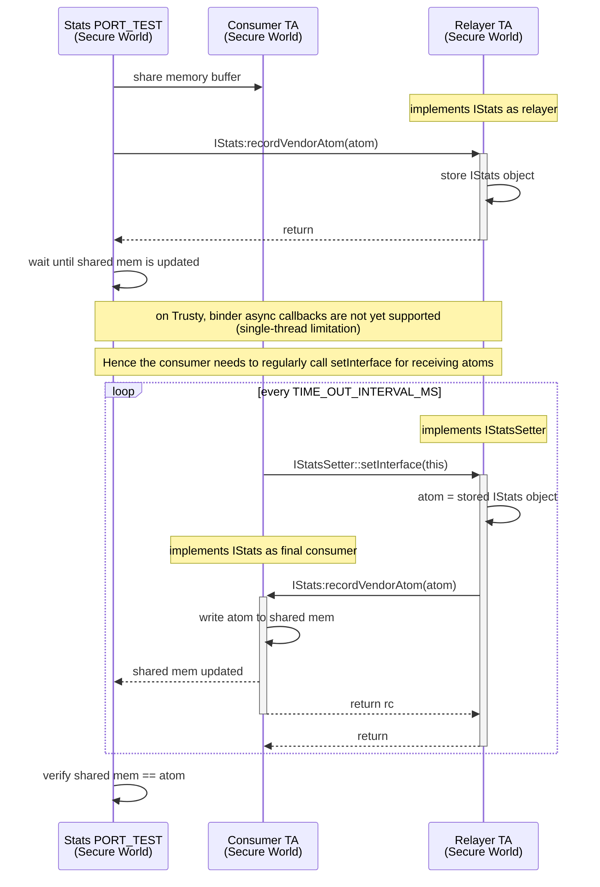
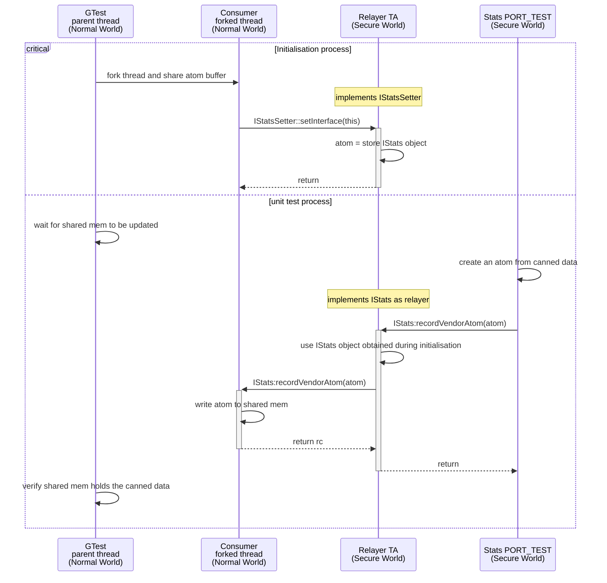

# Metrics Test

The metrics test consists at testing aidl endpoint establishment
and interaction between a vendorAtom Relayer (Metrics TA) in Trusty
and vendorAtom Consumer in Normal World.
The Consumer is expected to advertise itself to the relayer by sharing
its iStats facet via the iStatsSetter interface (AIDL Callback pattern).
Once the Consumer iStats facet is initialized, the Relayer can relay
atoms to the Consumer asynchronously, as soon as receiving them
from any Trusty TA.

We are going to support testing in two modes:

1- Consumer as a Trusty TA first
    Allows to test the Relayer as well as the atoms serialization
    library (see `trusty/interfaces/atoms`).
    Unfortunately asynchronous callback is not supported for Secure World
    initiators due to the single-threaded limitation in Trusty user-space.
    So for this test, we use the synchronous callback approach
    (refer to the sequence diagram in section 1.)

2- Consumer as a Normal-World Daemon
    Allows to test the desired architecture, with Consumer in Normal World
    as the asynchronous callback initiator.
    (refer to the sequence diagram in section 2.)

## 1. Consumer as a Trusty TA





### Build & Test


```
$ ./trusty/vendor/google/aosp/scripts/build.py qemu-generic-arm64-test-debug --skip-test
$ ./build-root/build-qemu-generic-arm64-test-debug/run --verbose --headless --boot-test "com.android.trusty.stats.test"
```

### Debug Crash Backtrace


```
$ export A2L=$PWD/prebuilts/clang/host/linux-x86/llvm-binutils-stable/llvm-addr2line
$ $A2L -e build-root/build-qemu-generic-arm64-test-debug/user_tasks/trusty/user/app/sample/stats-test/stats-test.syms.elf <address>
```

## 2. Consumer as a Normal-World Daemon





Implementation notes:

* The Trusty Relayer from section 1. is updated to also
expose an IStatsSetter port to the Normal World, store the Normal World IStats
callback facet, and use it asynchronously upon receiving atoms from
the Stats PORT_TEST.

* The Trusty Stats PORT_TEST is reused as is.

* The test sequence consists in starting the Normal-World GTest first, then
  the Stats PORT_TEST. Both unit tests should provide a PASS verdict for the
  test to succeed.
